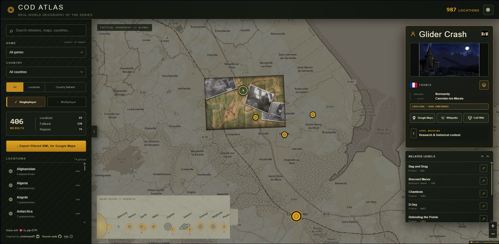

# CoD Atlas

CoD Atlas is an interactive map tracing the real-world geography portrayed
throughout the Call of Duty series. It connects campaign missions and
multiplayer maps with the countries, regions, cities, landmarks, and historical
sites they depict, adapt, or draw inspiration from.

## Explore the geography of the series

Browse the atlas on the map or search for a mission, multiplayer map, country,
or place. Results can be filtered by game, country, mode, and how precisely a
location has been identified.

Each entry explains what the marker represents and distinguishes a well-sourced
location from an approximate, regional, or country-level fallback. Where
available, the details include historical context, research notes, source
links, related levels, images, and geographically aligned map overlays.

Filtered locations can also be exported as KML for use in Google Maps and
other compatible mapping tools. Settings without a terrestrial location are
kept in the atlas and presented separately instead of being assigned a
misleading point on Earth.

CoD Atlas is open and community-maintained. Locations are curated with
attention to source quality, geographic precision, and the difference between
a confirmed setting and a plausible real-world inspiration.

## How AI is used

AI may assist with researching levels, comparing in-game settings with real
places and historical events, and drafting cited research notes. It is treated
as a research and editorial aid, not as an authority.

The exact position of a marker is almost always verified or confirmed by a
human before it is published. When the evidence supports only an approximate
area, region, or country, the atlas says so instead of presenting the marker as
more precise than it is. This review-first approach is intended to keep
unverified "AI slop" out of the project.

Whenever AI is used to produce content, that content is explicitly marked at
the point where it appears. The disclosure is kept beside the affected text so
readers do not have to find a separate policy to understand how it was made.

## Documentation

Start with [CONTRIBUTING.md](CONTRIBUTING.md) for project setup, development,
data changes, validation, and the pull-request workflow.

Detailed references:

- [Atlas data model](docs/data-model.md)
- [Data contribution guide](docs/contributing-data.md)
- [Running npm commands through Docker](docs/docker-commands.md)
- [Wiki import command](docs/wiki-import.md)
- [AI instructions for level map research](docs/map-research-ai-instructions.md)
- [Level templates](docs/templates/)

## Licensing and attribution

See the [source-code license](LICENSE), [data license](LICENSE-DATA), and
[notices and attribution](NOTICE.md).
