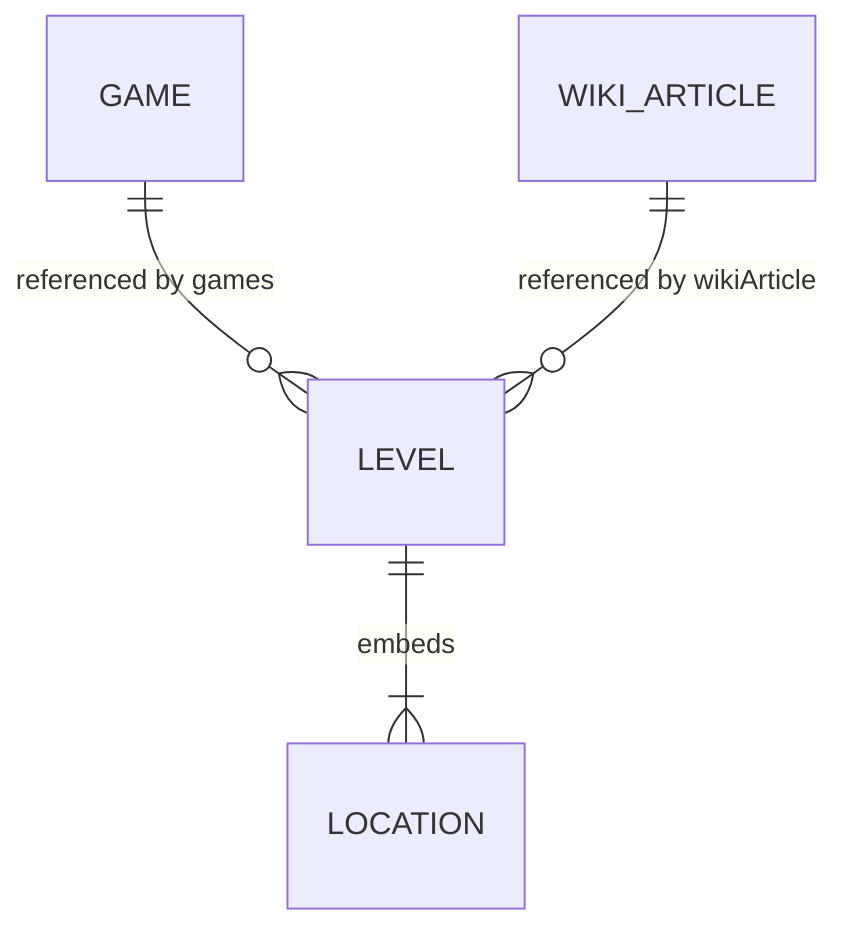
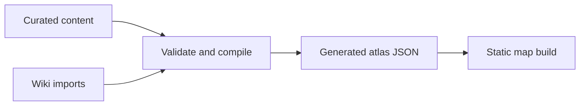

# Atlas data model

The repository separates human-curated atlas records from machine-oriented
Wiki imports. There is no database and no shared place entity.

## Relationships



- `content/games/*.yaml` supplies stable game IDs, readable labels, codes, and
  release dates.
- `content/levels/**/*.md` is the curated source for level classification,
  coordinates, precision, and notes.
- `content/wiki-import/articles/*.json` stores repeatable Wiki-import results
  and media attribution.
- `app/data/atlas.generated.json` is a derived browser dataset.

## Game record

```yaml
id: cod3
code: COD3
label: CoD 3
released: 2006-11-07
```

The release date controls the game-filter ordering. Labels should be concise
but understandable without prior knowledge of internal abbreviations.

## Level record

The YAML frontmatter contains structured data; the Markdown body contains
research or editorial notes.

Required fields:

- `id`: stable, repository-wide level ID.
- `title`: human-readable level or map name.
- `games`: one or more game IDs.
- `mode`: `singleplayer` or `multiplayer`.
- `wikiArticle`: foreign key to a Wiki import record.
- `locations`: one or more embedded location records.

One level can embed multiple locations. Each location has a locally unique
`id`, a country/group name, and normally coordinates. Coordinates are not
deduplicated across levels.

Precision values:

- `exact`: verified landmark or exact point.
- `approximate`: researched estimate rather than an exact point.
- `city`: city-level evidence.
- `region`: regional evidence.
- `country`: country fallback.
- `off-world`: no terrestrial coordinates.

`confidence` and `method` are required on every location. Their allowed values
and decision guidance are documented in the
[data contribution guide](contributing-data.md). Copy-ready records live in
[`docs/templates/`](templates/).

`primary: true` identifies the main location when a level contains several.

## Wiki import record

The stable `id` is the foreign-key target. Import-oriented fields include:

- Fandom page and revision IDs.
- Source and canonical article URLs.
- Wiki-provided level-location text and link.
- Map-style classification and supporting evidence.
- Main and map images.
- Image detail pages, authors, author profiles, licenses, and license URLs.
- Optional raw import payload.

Null fields mean that the value has not been imported yet. Third-party media
must retain the license shown on its source detail page.

## Build flow



Run `npm run data:build` to validate IDs, foreign keys, enum values, coordinate
pairs, and ranges before regenerating the browser dataset. Never manually edit
the generated JSON.

Docker equivalent:

```sh
docker compose run --rm cod-atlas-tools npm run data:build
```

Marker clustering is a display concern. It may group nearby markers according
to zoom level, but it must not mutate or merge the underlying locations.
