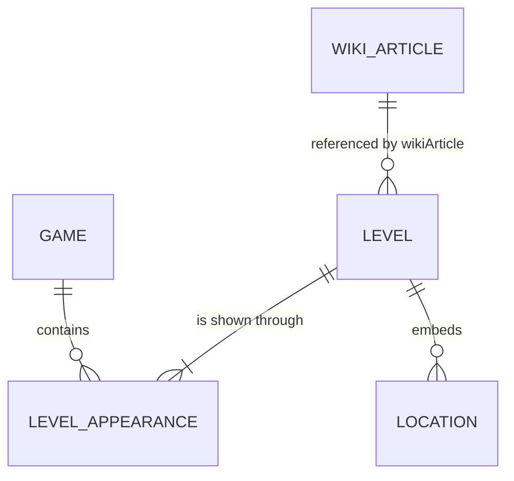
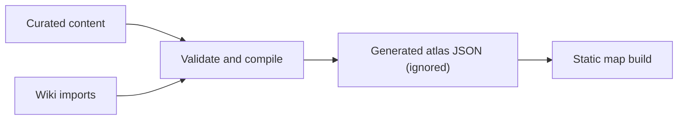

# Atlas data model

The repository separates human-curated atlas records from machine-oriented
Wiki imports. There is no database and no shared place entity.

## Relationships



- `content/games/*.yaml` supplies stable game IDs, readable labels, codes,
  release dates, franchise categories, and release eras.
- `content/levels/**/*.md` is the curated source for level classification,
  coordinates, precision, and notes.
- `content/wiki-import/articles/*.json` stores repeatable Wiki-import results
  and media attribution.
- `app/data/atlas.generated.json` is a derived, ignored browser build artifact.

## Game record

```yaml
id: cod3
code: COD3
label: CoD 3
released: 2006-11-07
category: world-war
era: classic
```

The release date controls the game-filter ordering. Labels should be concise
but understandable without prior knowledge of internal abbreviations. An
optional `public/images/games/<game-id>.png` is detected during the build and
exposed as the game's `icon`; games without one continue to display their
label.

Game categories are `world-war`, `modern-warfare`, `black-ops`, and
`standalone`. Release eras are `classic`, `golden`, `sci-fi`, `reboot`, and
`live-service`. Expansions, handheld releases, remasters, and other spinoffs
use the era in which that edition was released.

The generated country groups include a `continent` used by the advanced
filters. Standard countries are classified through `world-countries`; named
waters, the Arctic, and off-world settings use explicit supplemental buckets.

## Level source layout

Level files use one of two directory layouts while map-type folders are rolled
out incrementally:

```text
content/levels/<primary-game>/<level-slug>.md
content/levels/<primary-game>/campaign/<order>-<level-slug>.md
content/levels/<primary-game>/multiplayer/<level-slug>.md
content/levels/<appearance-game>/<level-slug>.ref.md
content/levels/<appearance-game>/<map-type>/<level-slug>.ref.md
```

A game must use one layout consistently. `cod`, `cod-uo`, `cod-fh`, and `cod2`
use `campaign/` for records whose `mode` is `singleplayer` and `multiplayer/`
for records whose `mode` is `multiplayer`. Games that have not been
reorganized remain flat. Map types are broad content categories; they are
distinct from multiplayer rule sets such as deathmatch or capture the flag.

Campaign orders start at `1`, have no leading zeros, and must be unique and
contiguous within their game. The prefix records play order without becoming
part of the stable level `id` or display title.

A full `.md` file is the canonical record and owns the stable ID, locations,
mode, overlays, and canonical research. A `.ref.md` file records that the same
level appears in another game. References live under that appearance's game,
so every game's directory provides a complete, manageable index of its levels.

## Level record

The YAML frontmatter contains structured data; the Markdown body contains
research or editorial notes.

Required fields:

- `id`: stable, repository-wide level ID.
- `title`: human-readable level or map name.
- `games`: exactly one game ID: the canonical owner game.
- `mode`: `singleplayer` or `multiplayer`.
- `wikiArticle`: foreign key to a Wiki import record.
- `locations`: embedded location records. Use an empty list only when the
  level is known but its real-world location has not yet been curated.

Optional level fields include `campaign`, a grouping with a stable string `id`
and a human-readable `label`; `legacyIds`, which preserves old URL IDs after a
structural rename; and `metadata` for non-geographic descriptive values.

One level can embed multiple locations, or temporarily use `locations: []`
until location research is complete. Each location has a locally unique `id`,
a country, and normally coordinates. Optional geographic detail follows
the hierarchy `country` → `region` → `city` → `landmark`. A region may be a
state, province, constituent country, island, territory, or similar area;
landmarks are named sites such as rivers, castles, and buildings. Coordinates
are not deduplicated across levels.

Campaign metadata identifies the named campaign section that contains a level;
it is separate from the numeric play-order prefix in campaign filenames. Keep
the ID stable even if the display label is later corrected or translated.

Precision values:

- `exact`: verified landmark or exact point.
- `approximate`: researched estimate rather than an exact point.
- `city`: city-level evidence.
- `region`: regional evidence.
- `country`: country fallback.
- `off-world`: no terrestrial coordinates.

`confidence` and `method` are required on every location. Their allowed values
and decision guidance are documented in the
[data contribution guide](contributing-data.md). Copy-ready records live in
[`docs/templates/`](templates/).

Use `real-world-inspiration` when a verified real place inspired a fictional or
adapted in-game location. It distinguishes the real reference point from a
canonical claim that the in-game location is the landmark itself.

`primary: true` identifies the main location when a level contains several.

## Level appearance reference

An unchanged port, remaster, or rerelease uses a small reference file rather
than adding game IDs to the canonical record:

```md
---
level: cod-carentan
title: Carentan (Remastered)
wikiArticle: codwiki-carentan-remastered
metadata:
  engine: upgraded
---

Optional notes specific to this appearance.
```

Only `level`, `title`, `wikiArticle`, `campaign`, and `metadata` are accepted.
Omitted values inherit from the canonical record. The Markdown body, when
present, is shown before the inherited canonical notes; an empty body shows
only the canonical notes. Appearance references cannot set `id`, `games`, `mode`,
`locations`, precision/confidence/method values, or geographic overlays.

Create a new canonical level when a remake materially changes the playable
level or represented geography. Do not use an appearance reference merely
because two maps share a name.

An optional `mapOverlay` belongs in the level Markdown frontmatter when a
reviewed game map can be geographically calibrated. It records a local image,
opacity, all four `[latitude, longitude]` corners, and complete source and
non-free rights attribution. The compiler validates these fields and writes
them to the separate `app/data/map-overlays.generated.json` browser store;
overlay data is not added to the main atlas JSON.

Optional `historyOverlays` attach one or more geographically calibrated
historical figures to images embedded in the level's research Markdown. Each
record has a stable ID, a local PNG in the level's `extra/` directory (legacy
records under `public/images/maps/` are also accepted), opacity, four
corners, and complete author, publication, copyright, and non-free-rights
attribution. The Markdown body must embed the corresponding PNG filename.
The compiler validates both the image and that body reference, then writes the
records to `app/data/history-overlays.generated.json`. The frontend renders a
matching Markdown image as a control that can place or remove that historical
figure on the live map. History-overlay data remains separate from the main
atlas JSON and from game-map overlays.

## Wiki import record

The stable `id` is the foreign-key target. Import-oriented fields include:

- Fandom page and revision IDs.
- Source and canonical article URLs.
- Wiki-provided level-location text and link.
- Wiki-provided previous/next-level and game text, with every linked Wiki
  target retained for later reviewed mapping to curated IDs.
- Wiki-provided date text.
- Map-style classification and supporting evidence.
- Main and map images, including web-resolution display URLs.
- Image detail pages and optional author, uploader, license, or rights metadata.
- Optional raw import payload.

Null fields mean that the value has not been imported yet. Metadata supplied by
Fandom is retained, but only usable source, display, and detail-page URLs are
required for an article image.
The generated atlas exposes displayable media once per Wiki article through
the top-level `wikiMedia` object, rather than duplicating it for every marker.

Repository-hosted media is owned by a game appearance and grouped by level,
not by picture type:

```text
public/images/levels/
`-- <game-id>/
    `-- <level-slug>/
        |-- main.png                 # or main.jpg / main.webm
        |-- maps/
        |   `-- briefing-map.png
        `-- extra/
            `-- <filename-used-in-md>
```

For example, RTV Altavilla uses
`public/images/levels/rtv/altavilla/main.png` and
`public/images/levels/rtv/altavilla/maps/briefing-map.png`. A Markdown image
written as `` is served from that appearance's
`extra/research-photo.png` directory. Only create a level media directory when
media exists.

The build validates main-media signatures and exposes each file by appearance
through `levelBanners`. When a reference has no `main` file, the frontend uses
the canonical appearance's file, then imported Wiki media. These extracted or
captured images are credited to
[plp-gtr](https://github.com/plp-gtr); underlying game artwork retains its
original copyright.

## Build flow



Run `npm run data:build` to validate IDs, foreign keys, enum values, coordinate
pairs, and ranges before regenerating the browser dataset. Use
`npm run data:check` to perform the same validation without writing build
artifacts. Never manually edit or commit the generated JSON.

Docker equivalent:

```sh
docker compose run --rm cod-atlas-tools npm run data:build
```

Marker clustering is a display concern. It may group nearby markers according
to zoom level, but it must not mutate or merge the underlying locations.
