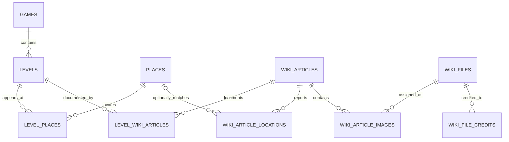

# Atlas and Call of Duty Wiki data model

The database deliberately separates manually curated atlas data from imported
Wiki evidence.

## Atlas-owned data

| Table | Purpose |
| --- | --- |
| `games` | Human-readable game names, codes, and release order |
| `levels` | A level in one game, including its verified mode |
| `places` | Curated marker positions and precision |
| `level_places` | Many-to-many connection between levels and real places |

## Wiki import data

| Table | Purpose |
| --- | --- |
| `wiki_import_runs` | Audit record for every scrape/import run |
| `wiki_articles` | Fandom article ID, URL, revision, and raw import payload |
| `level_wiki_articles` | Foreign-key bridge from atlas levels to Wiki articles |
| `wiki_article_locations` | Location strings and links exactly as found on the Wiki |
| `wiki_files` | Main/map image file page, original asset, and license fields |
| `wiki_file_credits` | One or more linked uploader/author/copyright credits |
| `wiki_article_images` | Assigns an imported file to `main`, `map`, or another role |

## Import rules

1. Resolve the supplied Wiki URL through the MediaWiki Action API and store the
   numeric page ID. Future refreshes query by page ID rather than title.
2. Upsert the article by `fandom_page_id`. Store its canonical URL, latest
   revision ID/timestamp, and the complete raw response.
3. Replace that article's imported location and image assignments in one
   transaction.
4. Store the Wiki's location label and link verbatim. A separate review step may
   set `matched_place_id`; imports must not change curated places or coordinates.
5. Upsert image files by their file detail-page URL or numeric Fandom page ID.
6. Store every available credit separately. Do not assume the uploader is the
   author or copyright holder.
7. Use `wiki_article_images.role` to distinguish the main image from a map image.
8. Record partial failures in `wiki_import_runs` and keep the last complete
   import for an article when a refresh fails.

## MediaWiki fields

The importer should use the standard `api.php` Action API:

- Article identity and refresh state: page `pageid`, canonical URL, revision
  `revid`, timestamp, and SHA-1.
- Images: file-page identity plus `imageinfo` fields such as original URL,
  dimensions, MIME type, SHA-1, and available `extmetadata`.
- Attribution: preserve the raw file-page/API response because copyright and
  author information is community-authored and may not use one consistent
  template.

The `raw_payload` columns are evidence/debug fields. UI code should use the
normalized columns and never parse raw JSON at request time.
