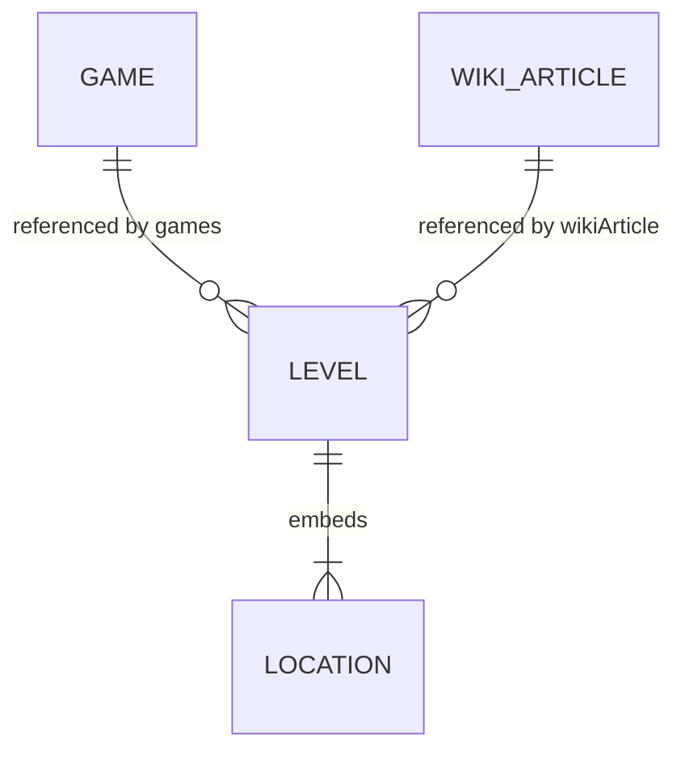
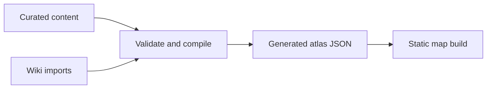

# Atlas data model

The repository separates human-curated atlas records from machine-oriented
Wiki imports. There is no database and no shared place entity.

## Relationships



- `content/games/*.yaml` supplies stable game IDs, readable labels, codes, and
  release dates.
- `content/levels/**/*.md` is the curated source for level classification,
  coordinates, precision, and notes.
- `content/wiki-import/articles/*.json` stores repeatable Wiki-import results
  and media attribution.
- `app/data/atlas.generated.json` is a derived browser dataset.

## Game record

```yaml
id: cod3
code: COD3
label: CoD 3
released: 2006-11-07
```

The release date controls the game-filter ordering. Labels should be concise
but understandable without prior knowledge of internal abbreviations. An
optional `public/images/games/<game-id>.png` is detected during the build and
exposed as the game's `icon`; games without one continue to display their
label.

## Level record

The YAML frontmatter contains structured data; the Markdown body contains
research or editorial notes.

Required fields:

- `id`: stable, repository-wide level ID.
- `title`: human-readable level or map name.
- `games`: one or more game IDs.
- `mode`: `singleplayer` or `multiplayer`.
- `wikiArticle`: foreign key to a Wiki import record.
- `locations`: one or more embedded location records.

One level can embed multiple locations. Each location has a locally unique
`id`, a country, and normally coordinates. Optional geographic detail follows
the hierarchy `country` → `region` → `city` → `landmark`. A region may be a
state, province, constituent country, island, territory, or similar area;
landmarks are named sites such as rivers, castles, and buildings. Coordinates
are not deduplicated across levels.

Precision values:

- `exact`: verified landmark or exact point.
- `approximate`: researched estimate rather than an exact point.
- `city`: city-level evidence.
- `region`: regional evidence.
- `country`: country fallback.
- `off-world`: no terrestrial coordinates.

`confidence` and `method` are required on every location. Their allowed values
and decision guidance are documented in the
[data contribution guide](contributing-data.md). Copy-ready records live in
[`docs/templates/`](templates/).

Use `real-world-inspiration` when a verified real place inspired a fictional or
adapted in-game location. It distinguishes the real reference point from a
canonical claim that the in-game location is the landmark itself.

`primary: true` identifies the main location when a level contains several.

An optional `mapOverlay` belongs in the level Markdown frontmatter when a
reviewed game map can be geographically calibrated. It records a local image,
opacity, all four `[latitude, longitude]` corners, and complete source and
non-free rights attribution. The compiler validates these fields and writes
them to the separate `app/data/map-overlays.generated.json` browser store;
overlay data is not added to the main atlas JSON.

## Wiki import record

The stable `id` is the foreign-key target. Import-oriented fields include:

- Fandom page and revision IDs.
- Source and canonical article URLs.
- Wiki-provided level-location text and link.
- Wiki-provided previous/next-level and game text, with every linked Wiki
  target retained for later reviewed mapping to curated IDs.
- Wiki-provided date text.
- Map-style classification and supporting evidence.
- Main and map images, including web-resolution display URLs.
- Image detail pages and author or uploader profiles.
- Either reusable license metadata or a recognized non-free rights notice.
- Optional raw import payload.

Null fields mean that the value has not been imported yet. Third-party media
must retain the license or non-free notice shown on its source detail page.
The generated atlas exposes displayable media once per Wiki article through
the top-level `wikiMedia` object, rather than duplicating it for every marker.

## Build flow



Run `npm run data:build` to validate IDs, foreign keys, enum values, coordinate
pairs, and ranges before regenerating the browser dataset. Never manually edit
the generated JSON.

Docker equivalent:

```sh
docker compose run --rm cod-atlas-tools npm run data:build
```

Marker clustering is a display concern. It may group nearby markers according
to zoom level, but it must not mutate or merge the underlying locations.
