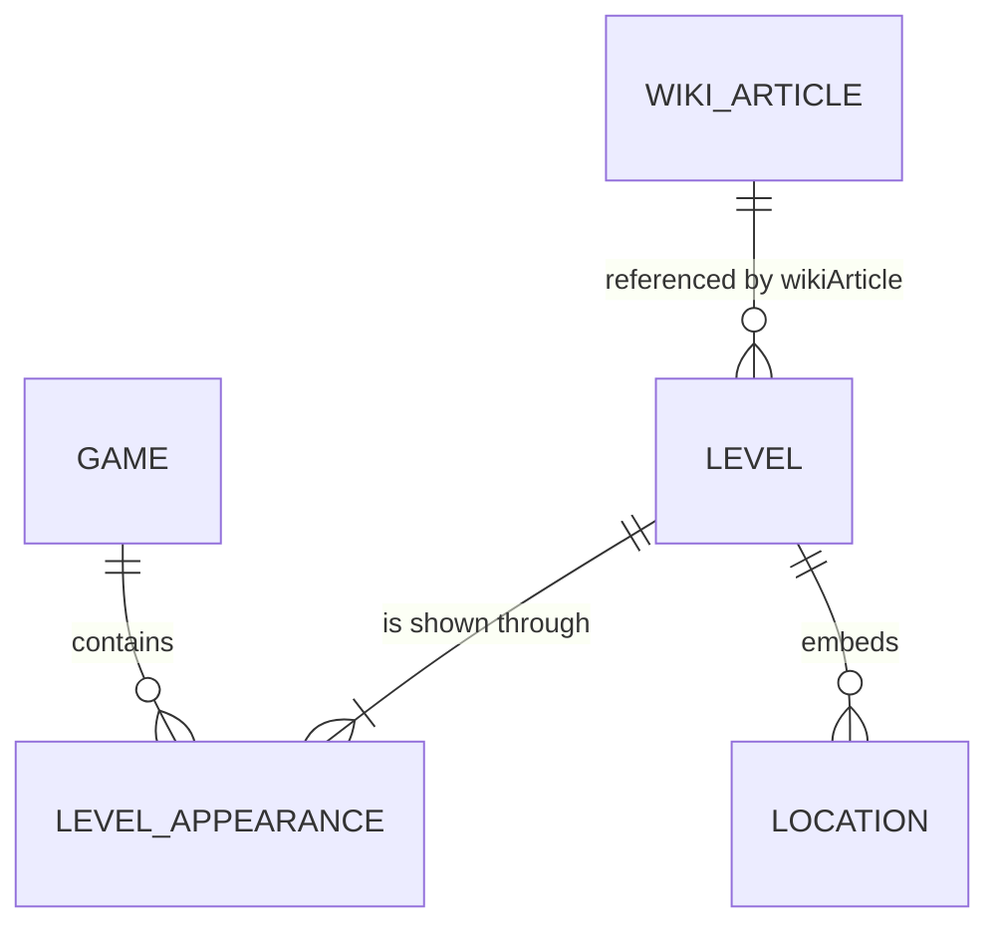
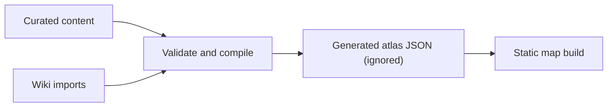

# Atlas data model

Human-curated records and machine-oriented Wiki imports are separate. No
database or shared place entity.

## Relationships


```mermaid
erDiagram
  GAME ||--o{ LEVEL_APPEARANCE : "contains"
  LEVEL ||--|{ LEVEL_APPEARANCE : "is shown through"
  WIKI_ARTICLE ||--o{ LEVEL : "referenced by wikiArticle"
  LEVEL ||--o{ LOCATION : "embeds"
```

| Path | Purpose |
| --- | --- |
| `content/games/*.yaml` | Stable game IDs, labels, codes, release dates, series |
| `content/levels/**/*.md` | Curated classification, coordinates, precision, notes |
| `content/wiki-import/articles/*.json` | Repeatable imports and media attribution |
| `app/data/atlas.generated.json` | Derived, ignored browser artifact |

## Game record

```yaml
id: cod3
code: COD3
label: CoD 3
labelLong: "Call of Duty 3"
released: 2006-11-07
series: world-war-ii
subseries: [main]
developer:
  - id: treyarch
    name: Treyarch
```

Release date orders game filters. Keep `label` concise and understandable
without internal abbreviations; `labelLong` is the full name for icon tooltips.
Builds detect optional `public/images/games/<game-id>.png` as `icon`;
without one, show the label.

Series: `world-war-ii`, `modern-warfare`, `black-ops`, `standalone`.
Optional `subseries`: `main`, `reboot`, `remaster`, `add-on`, `spin-off`.
A scalar is shorthand for a one-item list; omission compiles to `[]`.
Use `reboot` for reboot continuity (e.g. modern MW: `[main, reboot]`),
`add-on` for expansions (e.g. United Offensive).
`remaster` requires `remasterOf: <original-game-id>` (e.g. `cod4`);
games without that membership must omit it.

Every game requires a nonempty `developer` list. Entries have stable lowercase,
underscore-separated `id` and readable `name`; one ID must keep the same name
across games. Multiple studios or broad/historical groupings may coexist.

Generated country groups expose `continent` for advanced filters:
`world-countries` classifies standard countries; explicit supplemental buckets
cover named waters, the Arctic, and off-world settings.

## Level source layout

Prefer `content/levels/<game>/<map-type>/<filename>`:

| Mode | Subtype | Directory | Canonical filename |
| --- | --- | --- | --- |
| `singleplayer` | — | `campaign/` | `<order>-<descriptive-name>.md` |
| `multiplayer` | — | `multiplayer/` | `<descriptive-name>.md` |
| `zombies` | — | `zombies/` | `<descriptive-name>.md` |
| `other` | `special-ops` | `special-ops/` | `<descriptive-name>.md` |
| `other` | `survival` | `survival/` | `<descriptive-name>.md` |
| `other` | `challenge` | `challenge/` | `<descriptive-name>.md` |

Map types are broad categories, not multiplayer rules like deathmatch/capture
the flag. Use one layout per game: legacy flat rosters remain supported until
deliberate reorganization, but never mix flat canonical files and map-type
directories. Reorganize canonical files, references, and hosted level media together.

Campaign order starts at `1`, without leading zeros, unique and contiguous
per game. It records play order, never part of stable ID or display title.
Descriptive filenames organize files independently of IDs.

A canonical `.md` owns stable ID, mode/subtype, overlays, and research,
normally embedding locations; a variant may inherit via `metadata.variantOf`.
Unchanged appearances use `<descriptive-name>.ref.md` under the appearance
game's map-type directory, making each game directory a complete level index.

## Level record

YAML frontmatter holds structured data; Markdown holds research/editorial notes.
See the [field guide](contributing-data.md#level-fields) and [templates](templates/).

Required: repository-wide `id`, readable `title`, `games` containing exactly
one canonical owner ID, `mode`, `wikiArticle`. Only `other` requires
`modeSub` (`special-ops`, `survival`, `challenge`); other modes omit it.

`locations` embeds zero or more locations. Omit only to inherit from another
canonical level via `metadata.variantOf`; explicit `[]` intentionally stays
empty (including temporary lack of curated locations). Location IDs are unique
within the level; each has country and normally coordinates. Optional hierarchy:
`country → region → city → landmark`. Regions include states, provinces,
constituent countries, islands, territories; landmarks include rivers, castles,
buildings. Never globally deduplicate coordinates; only explicit variants inherit.

Optional fields:

- `campaign`: named section with stable string `id` and readable `label`,
  independent of filename order. Keep IDs through label corrections/translations.
  Identity includes mode and, for `other`, subtype, so matching campaign IDs
  across categories remain separate interface groups.
- `content-update`: original release/map pack/season/other release grouping,
  valid across all modes/subtypes within a game. Stable string `id` controls
  ordering; sidebar displays `label`. Use one label per ID per game.
  Example: `{ id: "2", label: Map Pack 1 }`; base game: `{ id: "0", label: Included }`.
- `legacyIds`: preserve old URL IDs after structural renames.
- `metadata`: the documented `variantOf` relationship for canonical variants.
  Preserve existing custom metadata during unrelated edits, but do not introduce
  additional keys without an explicit data-model change from the user. The
  parser accepting arbitrary keys does not establish a supported vocabulary.
  Research prose, citations, and marker explanations belong in the Markdown body,
  not this object. See the [template instructions](templates/README.md) for
  frontmatter-only requests.

Each separately selectable Special Ops/Survival/Challenge is `other` with its
subtype. Each Challenge is canonical; link reused campaign sections through
`metadata.variantOf` and omit `locations` to reuse geography.

Variants retain distinct identities, metadata, notes, modes, and gameplay.
Compilation/progress reporting resolve inherited locations into memory, following
valid chains. Unknown targets/cycles are invalid; any supplied `locations`,
even `[]`, overrides inheritance. Unchanged cross-game levels use references.

Human location/research review is independent:

```yaml
verified:
  locations:
    byHuman: true
    user: github/example-reviewer
  research:
    byHuman: false
    user: github/example-reviewer
    reason: The available evidence was reviewed but remains inconclusive.
```

Optional `verified` survives in generated entries and progress reports.
`byHuman: true` requires a nonempty reviewer. Unverified records may keep a
reviewer and optional `reason` for inconclusive review; use `user: null` if
unreviewed. Missing categories count as unverified. Location review covers all
resolved locations, including inherited ones. Completed research sections do
not imply human verification.

Every location needs `precision`, `confidence`, `method`; follow the
[field guide's values and decisions](contributing-data.md#allowed-values).
Precision is `exact` (verified point), `approximate` (researched estimate),
`city`, `region`, `country` (fallback), or `off-world` (no Earth coordinates).
Use `real-world-inspiration` for verified real inspiration of a fictional/adapted
setting, without claiming the game canonically depicts that landmark.
`primary: true` marks the main location among several and survives generation
for campaign routes/other level visualizations.

## Level appearance reference

Unchanged ports/remasters/rereleases use a reference, not extra `games` IDs:

```md
---
level: cod-carentan
title: Carentan (Remastered)
wikiArticle: codwiki-carentan-remastered
---

Optional notes specific to this appearance.
```

Only `level`, `title`, `wikiArticle`, `campaign`, `content-update`, `metadata` are accepted;
omitted values inherit. Nonempty Markdown precedes canonical notes; empty bodies
show canonical notes only. No overriding `id`, `games`, `mode`, `modeSub`,
locations, precision/confidence/method, or geographic overlays. Material changes
to geography/playable layout require a new canonical record; a shared name
alone does not justify a reference.

`content-update` on a reference describes its release group in the appearance
game. It does not inherit the canonical game's release group; omission leaves
the appearance ungrouped. IDs and labels must be consistent within that game.

Optional canonical overlays:

- `mapOverlay`: reviewed, geographically calibrated game map; local
  `maps/overlay.png` (default when `image` omitted) or `maps/overlay.jpg`,
  opacity, four `[latitude, longitude]` corners, descriptive source and
  non-free rights attribution. Omit attribution `sourceUrl` because repository
  URLs depend on branch/deployment. Compiler validates and writes separate
  `app/data/map-overlays.generated.json`, never main atlas JSON.
- `historyOverlays`: one or more calibrated historical figures, each with
  stable ID, local PNG/JPEG in the level's `extra/` (legacy
  `public/images/maps/` accepted), opacity, four corners, complete author,
  publication, copyright, and non-free-rights attribution. Markdown must embed
  the matching filename. Compiler validates image/body reference and writes
  `app/data/history-overlays.generated.json`, separate from atlas/game overlays.
  Frontend turns matching Markdown images into controls to add/remove figures
  on the live map.

## Wiki import record

Stable `id` is the foreign-key target. Fields include page/revision IDs,
source/canonical URLs; Wiki location text/link; previous/next/game text and all
linked targets for later reviewed ID mapping; date; map-style classification/
evidence; main/map images with display URLs, detail pages, optional author,
uploader, license/rights; optional raw payload. Previous/next links carry
`sequence` (`game`/`chronological`) and local `article` ID or `null`.

Null means not yet imported. Preserve supplied Fandom metadata; article images
require usable source/display/detail URLs. Generated `wikiMedia` stores
displayable media once per article, avoiding marker duplication.

Hosted media belongs to game appearances and is grouped by level:

```text
public/images/levels/<game-id>/<map-type>/<level-filename>/
  main.png          # or main.jpg / main.webm
  maps/overlay.png  # or overlay.jpg
  extra/<filename-used-in-md>  # PNG, JPEG, WebP
```

`<level-filename>` is the Markdown filename minus final `.md`, including
campaign order. Media mirrors source paths; ``
loads the appearance's `extra/research-photo.jpg`. Create media directories
only when needed.

Builds validate main-media signatures and expose files by appearance in
`levelBanners`. Missing reference banners fall back to canonical appearance,
then imported Wiki media. Credit extracted/captured images to
[plp-gtr](https://github.com/plp-gtr); original game artwork copyright remains.
Optimize raster media before commit, never during static builds; see
[image workflow](image-workflow.md) for conversion rules, dimensions, sizes, Docker.

## Build flow


```mermaid
flowchart LR
  A["Curated content"] --> B["Validate and compile"]
  C["Wiki imports"] --> B
  B --> D["Generated atlas JSON (ignored)"]
  D --> E["Static map build"]
```

`npm run data:build` validates IDs, foreign keys, enums, coordinate pairs/ranges,
then regenerates browser data. `npm run data:check` validates without writing.
Never edit/commit generated JSON. Use the [Docker prefix](docker-commands.md)
without host npm; agents run checks only on explicit request per `AGENTS.md`.

Clustering may group nearby markers by zoom, never mutate/merge source locations.
